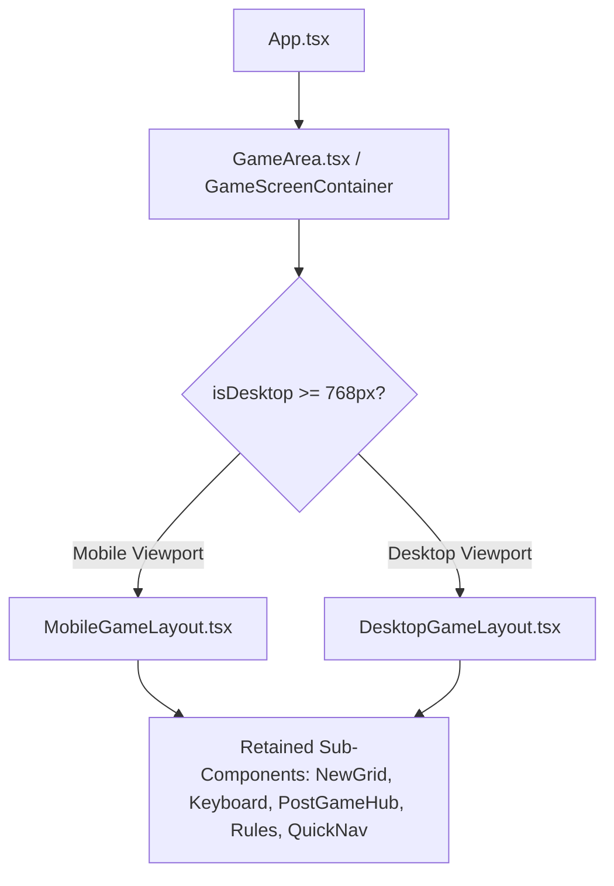

# Dedicated Layout Strategy: Mobile & Desktop Game Screen Architectures

## Problem Statement & Requirements
1. **Desktop Cramping & Sub-component Density**: On desktop, putting the grid, menus, and all post-game cards into an artificial cramped box causes squished components, clipped menus/rules, and poor scannability.
2. **Missing/Inconsistent Scroll & Overflow**: Need natural, smooth scroll/overflow containers across both mobile and desktop so no text, buttons, modals, or menus get truncated or inaccessible.
3. **Retain Existing Sub-Components**: Preserve existing game sub-components (`NewGrid`, `Keyboard`, `WordTriviaCard`, `ShareCard`, `NextActionCard`, `StreakMilestoneCard`, `MiniLeaderboardSnapshot`, rules modals) while decoupling how they are laid out on mobile vs desktop.

---

## Architectural Plan

We will separate the Game Screen presentation into distinct, dedicated layout components tailored for their respective viewports:

```
src/components/layout/game/
├── GameScreenContainer.tsx    (Orchestrator: manages responsive state, shared game handlers, and selects layout)
├── MobileGameLayout.tsx       (Tailored 1-column layout for mobile: during game & post-game)
├── DesktopGameLayout.tsx      (Spacious multi-pane layout for desktop: during game & post-game)
```



---

## Key Layout Distinctions

### 1. Mobile Game Layout (`MobileGameLayout.tsx`)
- **Playing State (Pre-Game Over)**:
  - Vertical flex container (`h-full`, `overflow-hidden`).
  - Top: Header clearance & quick nav controls.
  - Middle: Auto-sized grid centered in available viewport height.
  - Bottom: Full-width fixed keyboard anchored at bottom.
- **Post-Game State**:
  - Full vertical smooth scroll (`overflow-y-auto`, `min-h-0`, generous bottom padding).
  - Top: Compact / Collapsed Board card with "View Full Board" toggle.
  - Body: PostGameHub cards in a vertical stream (Share CTA, Word Trivia, Next Best Actions, Streak, Mini Leaderboard).

### 2. Desktop Game Layout (`DesktopGameLayout.tsx`)
- **Playing State (Pre-Game Over)**:
  - Centered, spacious container with independent scrolling if screen height is shallow.
  - Grid on top, keyboard below, with room for side helper tooltips (e.g. quick rules drawer / edit controls) placed naturally in side margins rather than clipped against screen edges.
- **Post-Game State (Dual-Pane Split Screen with Overflow)**:
  - **Left Pane (Sticky / Dedicated)**:
    - Victory Grid Card with toggle button, day indicator, and solve badge.
    - Fits cleanly on the left with dedicated breathing room.
  - **Right Pane (Scrollable Dashboard Hub)**:
    - High-visibility Share CTA Card and Word Trivia side-by-side.
    - Next Best Action Cards (Archive, WordUp, Guest, Marathons) in a wide 3-column row.
    - Streak Milestones & Mini Leaderboard in side-by-side columns.
    - Smooth `overflow-y-auto` scrollbar with proper padding so no content is ever cramped or clipped.

### 3. Overflow & Menu Placement Polish across All Screens
- **Rules & Help Popups**: Position popups with viewport-relative boundary clamping (using fixed center modals or floating cards with backdrop) so rules/help never overflow off-screen on narrow desktop containers or small phones.
- **Header & Navigation Menus**: Ensure scroll containers on both Mobile and Desktop have `min-h-0`, `overflow-y-auto`, and clean custom scrollbars (`scrollbar-thin`).

---

## Proposed File Changes

### 1. `src/components/layout/game/` (New Components)
- [NEW] `MobileGameLayout.tsx`: Dedicated mobile layout for active play & post-game.
- [NEW] `DesktopGameLayout.tsx`: Dedicated desktop layout featuring spacious dual-pane layout and proper desktop margins.

### 2. [MODIFY] `src/components/layout/GameArea.tsx`
- Refactor `GameArea.tsx` to act as the unified data & state orchestrator, delegating presentation cleanly to `DesktopGameLayout` or `MobileGameLayout` based on breakpoint / responsive hook.

### 3. [MODIFY] `src/components/NewGrid.tsx` & `src/components/postgame/PostGameHub.tsx`
- Ensure rules modals and quick nav menus use responsive relative positioning that adapts cleanly whether inside desktop dual-pane or mobile single-column.
- Ensure all parent containers allow smooth scroll overflow without clipping child shadows or popups.

---

## Verification Plan

### Automated Tests
- Run full test suite (`cmd.exe /c "npm test -- --run"`) to ensure no game logic regressions.
- Type check with `cmd.exe /c "npx tsc --noEmit"`.

### Manual & Responsive Verification
1. **Desktop Playing Mode**: Verify centered grid and keyboard with comfortable tile sizing and no cramped side menus.
2. **Desktop Post-Game Mode**: Verify side-by-side split layout (Victory Grid on left, post-game dashboard on right) with independent smooth scrolling and no squishing.
3. **Mobile Playing & Post-Game**: Verify mobile grid scaling, bottom-anchored keyboard, and smooth post-game scrolling.
4. **Window Resizing**: Resize browser from 360px up to 1920px and verify clean layout switching.
